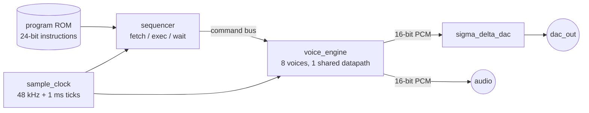

# Ballistic Synth

An 8-voice polyphonic synthesizer in SystemVerilog. A small sequencer CPU plays songs from a
program ROM; a time-multiplexed voice engine renders sine / square / saw / triangle / noise
voices with ADSR envelopes and per-voice effects at 48 kHz; a sigma-delta DAC puts audio on a
single pin. Songs are written in a tiny assembly language and assembled with a Python tool.



## Voice engine

All voices share one datapath and are processed one after another inside each 20.8 µs sample
period, four clocks per voice:

| Clock | Work |
|---|---|
| LOAD | select the voice's 32-bit phase, look up two neighbouring sine entries, advance the phase |
| OSC  | linear-interpolate the sine (or generate square/saw/triangle/noise), step the ADSR envelope |
| ENV  | sample x envelope level (hard multiplier) |
| MIX  | x volume (hard multiplier), saturating effect; added into the mix on the next clock |

A voice therefore costs registers only; the multipliers are shared. The engine needs
`4 * NUM_VOICES + 3` clocks per sample (35 for 8 voices); a 50 MHz clock provides 1041.

- **Tuning:** 32-bit phase accumulator, MIDI note table generated for exactly 48 kHz (A4 = 440 Hz).
- **Sample clock:** fractional divider, so the average rate is exactly 48,000 Hz from any master clock.
- **Envelope:** linear ADSR, 16 selectable times from 0 ms to 5 s; a new note attacks from the current level (no clicks).
- **Effects:** boost x2, cut x0.5, drive x4 into hard clip, 4-bit crush, 4:1 compression above half scale. All saturate.

## Instruction set

24-bit words: `[23:20]` opcode, `[19:17]` voice, `[16:0]` operand.

| Op | Mnemonic | Operand |
|---|---|---|
| 0x1 | `on v n` | `[6:0]` MIDI note — note-on |
| 0x2 | `off v` | — release |
| 0x3 | `wave v shape vol` | `[10:8]` waveform, `[7:0]` volume |
| 0x4 | `env v a d s r` | `[15:12]` attack, `[11:8]` decay, `[7:4]` sustain, `[3:0]` release |
| 0x5 | `fx v effect` | `[3:0]` effect |
| 0x6 | `wait ms` | `[15:0]` milliseconds |
| 0x7 | `jump label` | `[9:0]` address |
| 0xF | `halt` | — |

The assembler (`scripts/asm.py`) adds note names (`F#3`), voice ranges (`v0-3`, `all`),
chords (`chord C4 maj7`), labels and tempo-relative waits (`tempo 132`, `wait 1/2b`) that
never drift. See `programs/demo.asm`.

## Running it

Needs [Icarus Verilog](https://steveicarus.github.io/iverilog/) and Python 3 with numpy.

```
py scripts/run.py test       # 7 self-checking suites in parallel
py scripts/run.py demo       # renders programs/demo.asm to build/demo.wav
py scripts/run.py synth      # Lattice ECP5 via Yosys + nextpnr  (pip install yowasp-yosys yowasp-nextpnr-ecp5)
py scripts/run.py metrics    # everything above -> build/metrics.md
py scripts/gen_tables.py     # regenerate rtl/sine_table.sv, note_table.sv, env_rate.sv
```

The testbench (`sim/synth_tb.sv`) checks clock-level invariants in SystemVerilog (sample
rate, no X on the audio bus, no engine overrun, DAC ones-density) and dumps every sample;
`run.py` then analyses the audio in Python: pitch by zero-crossing regression, spectrum
(SFDR/THD/SINAD), RMS per waveform, envelope timing, 8-voice amplitude fit, effect
transfer curves, jump/halt behaviour and cumulative WAIT timing. Simulations run at the
engine's minimum 35 clocks per sample, plus one at a real 50 MHz clock.

## Results

From `py scripts/run.py metrics`. "Original" figures model the first version of the design as
written (including its uninitialised sine entry and integer-Hz note table); v2 figures are measured
from RTL simulation.

| Metric | Original | v2 |
|---|---|---|
| Regression | none | 31/31 checks, 7 suites, 25.6 s of audio / 45.8 M clock cycles |
| Voices | 4 (parallel datapaths) | 8 (time-multiplexed) |
| Playable notes | 32 (C3-G5) | 128 (full MIDI range) |
| Worst tuning error | 10.9 cents | 0.0007 cents |
| Sine SFDR / THD @ 880 Hz | 42.1 dB / -32.6 dB | 95.5 dB / -100.4 dB |
| Sine SINAD / ENOB | 21.1 dB / 3.2 bits | 87.4 dB / 14.2 bits |
| Envelope | none | ADSR, timing within 1.9 ms |

Lattice ECP5-25F (LFE5U-25F-CABGA256), Yosys + nextpnr, seed 1:

| | LUT4 | FF | MULT18X18 | Block RAM | Fmax |
|---|---|---|---|---|---|
| v1: 4 parallel voices (bug-fixed original) | 2406 | 355 | 4 | 1 | 66.0 MHz |
| v2: 8 time-multiplexed voices + ADSR + 1024-word program ROM | 3259 | 1214 | 4 | 4 | 52.2 MHz (50 MHz target met) |

Demo (`programs/demo.asm`, Ode to Joy): 282 instructions, 17 s, peak -6.3 dBFS, no clipping.

## Layout

```
rtl/        synth_top, sample_clock, sequencer, voice_engine, sigma_delta_dac, generated tables
sim/        synth_tb.sv
programs/   demo.asm
scripts/    asm.py, run.py, gen_tables.py, synthdefs.py
legacy/     original/ (first version, as written) and v1_bugfix/ (reviewed and fixed)
```
